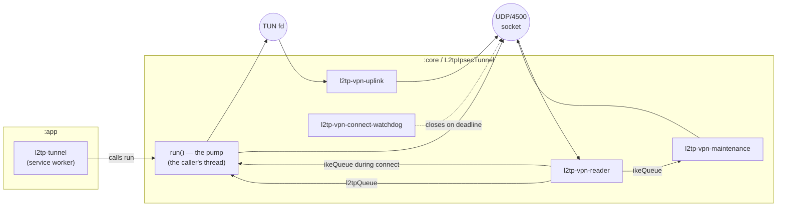

# Architecture

How the client is put together: the modules, the layering, the threads, and the seams that keep the
protocol stack free of Android.

See also: [protocol.md](protocol.md) for what happens on the wire, [android.md](android.md) for the
`VpnService` side, [rekeying.md](rekeying.md) for the maintenance thread's other job,
[security.md](security.md) for the credential handling.

## Contents

* [Modules](#modules)
* [The layering](#the-layering)
* [Threading model](#threading-model)
* [Platform seams](#platform-seams)
* [The data layer](#the-data-layer)
* [The connect sequence](#the-connect-sequence)
* [Known limitations](#known-limitations)

## Modules

Two Gradle modules plus a test lab.

| Module | Kind | Depends on | Why it exists |
| --- | --- | --- | --- |
| `:core` | plain `kotlin-jvm` library | nothing but the JDK | The entire protocol stack. No Android SDK reference anywhere, which is what lets it run in ordinary JVM unit tests and be driven against a real server from JUnit. |
| `:app` | `com.android.application` | `:core` | `VpnService`, platform adapters, encrypted profile and credential storage, Compose UI. |
| `testserver/` | Docker | — | A real strongSwan + xl2tpd + pppd LNS configured like the target router. See [testing.md](testing.md). |

The rule that keeps this honest: **`:core` must never reference an Android type.** Everything the
stack needs from the platform goes through four small interfaces (below). The consequence is that
the interesting code — key derivation, ISAKMP encoding, ESP, the L2TP control channel, the PPP
automaton — is testable without a device or an emulator, and that a protocol bug can be reproduced
in a unit test rather than by watching a phone.

The same discipline is applied one level up wherever it is affordable. `:app` classes that hold no
Android types — `VpnProfile`, the form reducer and validator in `ui/profile/`, `ConnectPreparation`,
`StartAction`, `ReconnectPolicy`, `LogRingBuffer` — are deliberately written that way so they can be
unit-tested too, and the preference layout in `data/ProfileStorage.kt` touches `SharedPreferences`
only through the interface, so reading, writing and the schema migration run against a fake on a
plain JVM: no `Context`, no keystore, no Robolectric.

### `:core` packages

| Package | Contents |
| --- | --- |
| `util` | Bounds-checked big-endian `ByteReader`/`ByteWriter`, byte/hex helpers, constant-time compare, the `VpnLogger` seam and `ProtocolException`. |
| `crypto` | The algorithm vocabulary (`IkeEncryption`, `IkeHash`, `DhGroup`, `EspEncryption`, `EspIntegrity`) mapping wire transform IDs to JCE names, MODP Diffie–Hellman, the HMAC PRF with RFC 2409 key expansion, CBC ciphers. |
| `ike` | ISAKMP codec and payload model, `IkeV1Negotiator` (main mode, aggressive mode, quick mode, informational), the key schedule, NAT-T vendor IDs and dialect selection. |
| `esp` | `EspOutboundSa` / `EspInboundSa` (transport mode), the sliding anti-replay window, RFC 3948 UDP-encapsulation framing and classification. |
| `net` | IPv4 header and UDP datagram codecs and the internet checksum, used to build the *inner* UDP/1701 datagram. |
| `l2tp` | L2TPv2 header and AVP codec (including AVP hiding), and `L2tpTunnel`: the control channel with Ns/Nr, retransmission, ZLB acks and HELLO. |
| `ppp` | The RFC 1661 negotiation automaton reduced to a client, LCP, PAP, CHAP-MD5, MS-CHAPv2 (with its own MD4 because the JDK has none), IPCP with the RFC 1877 DNS options. |
| `tunnel` | `VpnConfig`, `TunnelState`/`TunnelListener`, the platform seams, `Mtu` budgeting, and `L2tpIpsecTunnel`, which drives everything above. |

Dependencies run strictly downwards: `tunnel` knows about all of them, `ike`/`esp`/`l2tp`/`ppp` know
about `crypto`/`net`/`util` and about `tunnel` only for `VpnConfig`, `Clock` and the error types.
Nothing in `ike` knows about `l2tp`, and nothing in `l2tp` knows about `esp`.

## The layering

One socket carries everything.

```
                         ┌───────────────────────────────┐
   the user's apps ─────►│  VpnService TUN (10.x.x.x/32) │◄──── routed 0.0.0.0/0
                         └───────────────┬───────────────┘
                                         │ IP packet
                                ┌────────▼────────┐
                                │   PPP frame     │  FF 03 + 2-byte protocol
                                └────────┬────────┘
                                ┌────────▼────────┐
                                │ L2TPv2 data msg │  tunnel id / session id the peer assigned
                                └────────┬────────┘
                                ┌────────▼────────┐
                                │  UDP 1701→1701  │  checksum 0
                                └────────┬────────┘
                                ┌────────▼────────┐
                                │ ESP transport   │  SPI, Seq, IV, ciphertext, ICV
                                └────────┬────────┘
                                ┌────────▼────────┐
                                │  UDP/4500       │  protected DatagramSocket
                                └─────────────────┘
```

The same socket also carries ISAKMP (behind the four-byte non-ESP marker) and the one-byte NAT
keepalives. The reader thread tells the three apart by their first bytes; see
[protocol.md](protocol.md#one-socket-three-kinds-of-traffic).

## Threading model

`L2tpIpsecTunnel.run()` blocks on the caller's thread until the tunnel terminates. Around it the
tunnel spawns four threads, all daemons.



| Thread | Owner | Job | Ends when |
| --- | --- | --- | --- |
| the caller's thread | `:app`'s `l2tp-tunnel` worker | Runs the whole connect sequence, then becomes the **downlink pump**: dequeues L2TP packets, drives `L2tpTunnel` and `PppSession`, writes IP packets to the TUN, and finally sends the polite teardown. | `run()` returns |
| `l2tp-vpn-reader` | tunnel | The only reader of the socket. Classifies each datagram and pushes it onto `ikeQueue` (32 slots) or `l2tpQueue` (256 slots). Decrypts ESP, demultiplexing on the SPI. | stop requested, socket closed, or too many consecutive read failures |
| `l2tp-vpn-uplink` | tunnel | Blocking-reads the TUN, wraps each IP packet in PPP + L2TP + UDP + ESP and sends it. | TUN closed (which is how it is unblocked) |
| `l2tp-vpn-maintenance` | tunnel | Owns everything ISAKMP once the tunnel is up: drains the deferred queue and then `ikeQueue`, runs both rekey schedules, retires superseded SAs, sends NAT keepalives. | stop requested or a maintenance failure |
| `l2tp-vpn-connect-watchdog` | tunnel | Bounds the *whole* establishment, not just individual layers. Closes the socket if `CONNECTED` is not reached before `connectTimeoutMs`, recording which state stalled. | `CONNECTED` reached, or the deadline fires |
| `l2tp-vpn-reaper` | tunnel, on `stop()` | Sleeps a grace period, then closes the socket and interrupts the reader. Backstop only. | after one sleep |

### Who owns what

The rule is simple and load-bearing:

* **`PppSession` and `L2tpTunnel` are single-threaded and are driven exclusively by the pump.**
  Neither is synchronised. `onPacket`/`onFrame` and `tick` are called from the pump only. During the
  handshake the pump is inside `negotiatePpp`; afterwards it is inside `pumpDownlink`. The one
  exception is `L2tpTunnel.close()`, which only appends to the send path.
* **The uplink thread never touches the L2TP or PPP state machines' mutable state** — it calls
  `encodePppFrame`, which reads two already-fixed session ids and does pure encoding.
* **`IkeV1Negotiator` is single-threaded and stateful** (it owns one ISAKMP SA's cookies and its
  NAT-T dialect). It is used from the pump during the handshake and from the maintenance thread
  afterwards; every use is serialised on one lock so a rekey and a teardown cannot overlap.
* **Security associations are published, never mutated.** The maintenance thread is the only writer
  of the current/previous SA references; the reader and uplink threads read volatile references. An
  SA object is never modified once published, so no lock is needed on the data path.
* **Counters are atomics**, so the stats snapshot never needs a lock.

### Why the maintenance thread exists

A rekey blocks on the peer for a round trip or three. Doing that on the pump would stall user
traffic for as long as the peer takes to answer, and the pump owns the PPP and L2TP state machines,
which are explicitly single-threaded — a rekey that ran there could not also service HELLOs and LCP
echoes. Splitting it out costs one thread and one lock and buys a rekey that is invisible to
traffic.

### Why the connect watchdog exists

Each layer has its own retransmission budget. A peer that answers phase 1 and then goes quiet would
otherwise keep the user on a spinner for the sum of all of them. A wrong pre-shared key is exactly
that case: strongSwan answers with an informational the client cannot decrypt, i.e. with silence, so
the failure would take over a minute to surface. The watchdog caps the whole establishment and,
crucially, records *which state* stopped making progress — that is the difference between "check
your PSK" and "check your password" in the error the user sees.

### How a stop actually unblocks everything

Threads parked in a blocking read do not notice a flag. The ordering matters and is explained in
full in [android.md](android.md#the-teardown-ordering-trap); in summary:

1. `stop()` sets the flag and **closes the TUN** — that is what unblocks the uplink thread, whose
   read no timeout will ever interrupt.
2. The socket is deliberately **left open** so the pump can still push PPP Terminate, L2TP
   CDN/StopCCN and the ISAKMP Deletes out of it.
3. The transports handed to the negotiating layers turn a stop request or an expired connect
   deadline into an exception on *receive*, while still allowing *sends* — otherwise a layer sitting
   in its own retransmission loop would keep retransmitting into a socket nobody reads.
4. A reaper closes the socket after a grace period, as a backstop for a control thread that never
   got that far.

## Platform seams

Four interfaces in `core.tunnel` are everything the stack needs from the outside world. They exist
so the protocol code has no Android dependency and so tests can substitute loopback sockets, an
in-memory TUN and a virtual clock.

| Seam | Contract | Android implementation | Test implementation |
| --- | --- | --- | --- |
| `UdpSocketFactory` → `UdpSocketChannel` | Opens a UDP socket **that bypasses the VPN being built**, and reports a real (never wildcard) local address. `receive` blocks up to a timeout and returns `null` on expiry. | `AndroidUdpSocketFactory`: binds the wildcard address so the kernel picks the source per destination, calls `VpnService.protect()` on every socket and treats a refusal as fatal, then resolves the true local address by connecting a throwaway probe socket to the peer. | `TestUdpSocketFactory`: a plain `DatagramSocket`, with the same probe trick for the local address. |
| `TunProvider` → `TunInterface` | Creates the virtual interface once PPP has produced an address; `readPacket` is one blocking read per IP packet and returns `-1` once closed. Returns `null` if the user revoked consent. | `AndroidTunProvider`: drives `VpnService.Builder` and hands the raw descriptor back to the service so it can be closed to break a blocking read. | `FakeTun`: two in-memory queues plus `inject()`/`awaitInbound()`, which is how the ICMP probe in the live tests gets in and out. |
| `Clock` | `nowMs()` and `sleep()`. | the system clock | `FakeClock` in the L2TP and PPP tests: a virtual clock advanced by every wait, so retransmission and timeout paths are exercised without sleeping. |
| `VpnLogger` | One `log(level, tag, message, error)` function. | `AndroidLogger`: writes to logcat under `L2TP.<tag>` *and* to an in-memory ring buffer the in-app log screen renders. | `VpnLogger.STDOUT` or `NONE`. |

Why the local address matters enough to justify a probe socket: the IKE identity payload and both
NAT-D hashes are computed over it. A socket bound to the wildcard address reports `0.0.0.0`, which
would make the peer's NAT detection nonsense. `connect()` on a UDP socket is a purely local
operation — no packet leaves the device — so the probe is free.

## The data layer

`:app`'s `data/` package has one job — persist the saved connections — and one seam that is worth
more than the rest of the package put together: **which callers can read a credential.**

```
                      VpnStorage        opens nothing until somebody suspends
                           │
        ┌──────────────────┼──────────────────────┐
        │                  │                      │
  profileStore()     secretVault()          secretReader()
        │                  │                      │
        ▼                  ▼                      ▼
┌────────────────┐  ┌──────────────────┐  ┌──────────────────┐
│ ProfileStore   │  │ SecretVault      │  │ SecretReader     │
│                │  │                  │  │                  │
│ profiles       │  │ isSet            │  │ read             │
│ activeProfileId│  │ store            │  │                  │
│ state          │  │ clear            │  │ NO OTHER CALLER  │
│ upsert/delete  │  │ clearAll         │  │                  │
└────────────────┘  └────────┬─────────┘  └────────┬─────────┘
  UI + service        UI only│                     │service only
                            ┌▼─────────────────────▼┐
                            │ PreferenceSecretVault │  one object, one cache
                            └───────────┬───────────┘
                                        │
                            ┌───────────▼───────────┐
                            │ LazyPreferences       │
                            │  EncryptedShared-     │
                            │  Preferences, or the  │
                            │  plaintext fallback   │
                            └───────────────────────┘
```

| Type | Given to | Why it exists |
| --- | --- | --- |
| `ProfileStore` | UI and service | The saved connections as `StateFlow`s. Nothing on it blocks and nothing on it throws: loading is a state (`LOADING` / `READY` / `UNREADABLE`), and every mutator is `suspend`. |
| `SecretVault` | **UI only** | Can say a secret exists and can replace or delete one. Has no getter, so no screen can display a stored credential. |
| `SecretReader` | **service only** | The single read path. `ui/` does not import the type anywhere. |
| `AppComponents` | both | Wires the three together once per process, off the main thread. It is the only place outside `data/` that names the factory. |

The two secret interfaces are views of the *same* `PreferenceSecretVault`, so there is one copy of
the data and one cache; the separation that matters is at the hand-out point, not two stores. The
full argument, and where the guarantee still leaks, is in
[security.md](security.md#the-never-reveal-guarantee).

Three consequences worth knowing before changing anything here:

* **`VpnProfile` is a plain record with no secret.** The only way from a profile to a `VpnConfig` is
  `prepareConnect`, which takes the two `CharArray`s as parameters — so the type system, not a
  convention, is what keeps the credentials out of the object graph the UI holds.
* **Nothing opens a store on the caller's thread.** `LazyPreferences` defers the first keystore
  access until somebody suspends on it. See
  [android.md](android.md#nothing-touches-storage-on-the-main-thread).
* **Two locks, always taken in the same order.** Both the store and the vault open the preferences
  *outside* their own lock, because taking the two in opposite orders would deadlock on the first,
  slow keystore access.

## The connect sequence

`L2tpIpsecTunnel.connectAndPump()` walks the states in `TunnelState`, reporting each one through
`TunnelListener` so the UI and the notification can follow along.

```
RESOLVING          resolve the server name
                   open the protected socket, start the reader and the watchdog
IKE_PHASE1         main (or aggressive) mode → Phase1Result
                   abort here if the peer did not negotiate NAT traversal at all
IKE_PHASE2         quick mode → Phase2Result, install the ESP SA pair
                   compute the header-budget MTU
L2TP_TUNNEL        SCCRQ → SCCRP → SCCCN
L2TP_SESSION       ICRQ → ICRP → ICCN
PPP_NEGOTIATION    LCP → authentication → IPCP
                   clamp the MTU to the peer's MRU, de-duplicate the DNS list
                   establish the TUN
CONNECTED          start the uplink and maintenance threads, pump packets
```

`TunnelState` also has `RECONNECTING` (set by the service, not by the tunnel), `DISCONNECTING`,
`FAILED` and `IDLE`.

Failures are categorised into `TunnelErrorKind` so the UI can say something actionable rather than
printing a stack trace; the full list and what to check for each is in
[troubleshooting.md](troubleshooting.md#what-each-tunnelerrorkind-means).

## Known limitations

Stated plainly, because discovering these from the code costs an afternoon each.

* **IPv4 only.** IKEv1 over IPv6 is rejected explicitly. IPv6 inside the tunnel is not negotiated
  (no IPV6CP); with `blockIpv6` on — the default — a `::/0` route with no IPv6 address blackholes v6
  so dual-stack traffic cannot leak around the tunnel.
* **The path MTU is never measured.** The header budget is computed from a fixed 1500-byte
  assumption and then clamped to the peer's PPP MRU. On a path with a smaller MTU the clamp will not
  save you. See [protocol.md](protocol.md#mtu-the-header-budget-and-the-mru-clamp).
* **Phase 1 renegotiation started by the peer is not handled.** A Main Mode arriving under cookies
  we do not know is dropped and the tunnel eventually reconnects. See
  [rekeying.md](rekeying.md#what-is-deliberately-not-covered).
* **DPD is answered but never initiated.** The negotiator can send `R-U-THERE`, but nothing calls
  it; liveness relies on the L2TP HELLO and the LCP echoes instead.
* **No per-app split tunnelling and no split routing.** The TUN takes `0.0.0.0/0` and applies to
  every app. `addDisallowedApplication` / `allowBypass` are never called.
* **Only one tunnel at a time.** The service owns a single `L2tpIpsecTunnel`; multiple profiles can
  be saved but only the active one connects.
* **No import or export of profiles.** Which also means nobody has had to decide what such a file
  would do about the credentials.
* **Credential storage has not been verified on a device.** It is read-only review plus plain-JVM
  tests against a fake store, because `AndroidKeyStore` does not exist off-device. See
  [security.md](security.md#what-is-not-claimed).
* **No always-on / boot reconnect state of its own.** The service is exported, gated behind
  `BIND_VPN_SERVICE` and handles the platform's `android.net.VpnService` start action, so always-on
  works; there is no boot receiver and nothing else supports that mode explicitly.
* **`TunnelErrorKind.NETWORK_UNREACHABLE` is declared but never produced.** A dead network surfaces
  as `IKE_NO_RESPONSE` instead.
* **Only CBC ciphers.** Combined-mode ciphers (AES-GCM) would need a different ESP layout and the
  target hardware does not offer them.
